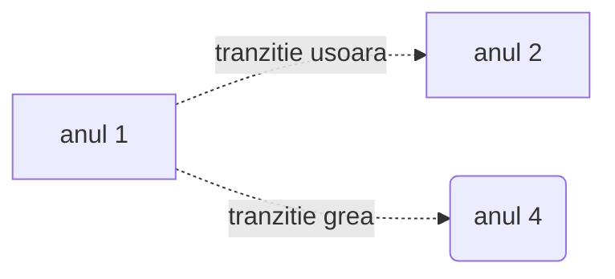
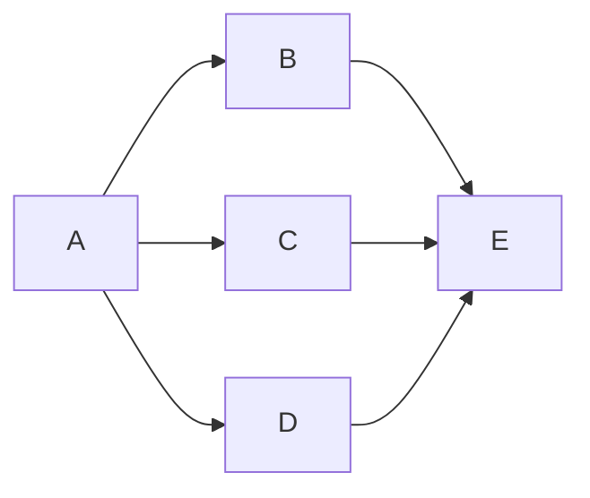

# Diagrame de tip _Flowchart_

**De retinut:**
- Diagramele _flowchart_ au noduri si conectori
- Nodurile au:
   - **Forma** (data de parantezele folosite la descrierea _nodului_)
   - ID (sirul folosit in afara descrierii nodului)
   - Descriere (textul ce apare in caseta nodului si care este implementat in interiorul diferitelor tipuri de paranteze - ce decid forma casetei nodului)
- Conectorii au:
  - Diferite tipuri de sageti sau chiar pot activa fara sageti
  - Diferite tipuri de linii:
  - '-->' linie continua sageata spre dreapta
  - '--' linie continua fara sageti
  - '<-->' linie continua cu sageti stanga si dreapta
  - '==>' linie continua ingrosata

timeline
title "My timeline"
section "sectiunea 1"
2023-2024
        : am luat la facultate
        : am luat contact cu mediul academic
2024-2025
        :am terminat anul 1
        :am facut grafice 
section "Sectiunea 2"

2025-2026
        : Am facut practica la fotogrametrie
